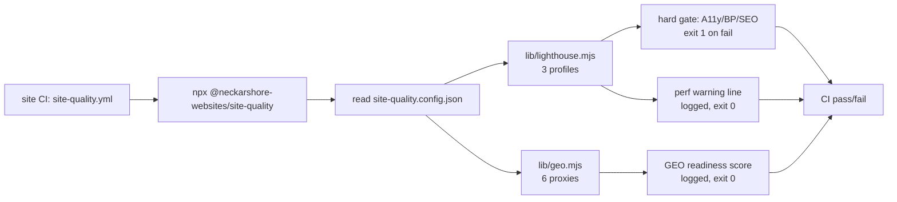

# Shared Site-Quality Architecture — Design Spec

> **Status:** Design — awaiting user review, then MASCHIN codification (Brief #458), then Linus implementation.
> **Author:** Linus (Frontend), 2026-06-02.
> **Governance:** Cross-site architecture. Designed here → MASCHIN codifies (updates Codify-Brief #458) → Linus implements. Org-restructuring (SP1) is Founder/MASCHIN-executed, not Linus.
> **Scope:** All 4 neckarshore-ecosystem websites — neckarshore.ai, rauhut.com, oakwoodgolfclub.de, goldoni.

## 1. Problem

Lighthouse CI quality gates have diverged across the four sites and caused recurring pain:

1. **Divergence:** Only 2 of 4 sites have an active Lighthouse gate today (neckarshore + oakwood via `scripts/lighthouse.mjs`); rauhut + goldoni run lint only. No shared source of truth — each site's config is a hand-maintained copy that drifts.
2. **Flapping hard gates:** The Desktop performance gate (threshold 95) fails repeatedly on perf-neutral changes because GitHub-Actions shared-CPU runners produce ~19pp performance score variance. This blocked content-clean PRs (oakwood PR #31, goldoni PR #83) and triggered off-by-one threshold-calibration cascades (goldoni PRs #80/#81/#82).
3. **Mislabeled mobile profiles:** The slow mobile profile was labeled "Edge-5G" but uses 400 Kbps / 6× CPU throttling — that is slower than 4G, not 5G. The label inverted reality.
4. **No GEO measurement:** Generative Engine Optimization (whether ChatGPT / Perplexity / Claude / Google AI Overviews cite the sites) is being *worked* (llms.txt, schema, AI-citation passes) but is *not measured*. Lighthouse's "SEO 100" score covers classic on-page hygiene only — it says nothing about AI citability.

## 2. Decisions (locked during brainstorming 2026-06-02)

| # | Decision | Value |
|---|----------|-------|
| 1 | Theme order | Lighthouse foundation first, GEO layer second (GEO bolts onto a stable measurement harness) |
| 2 | Governance | Design here → MASCHIN codifies (Brief #458) → Linus builds |
| 3 | Org topology | New org `neckarshore-websites`, agency model — all 4 sites move in (SP1, Founder/MASCHIN-executed) |
| 4 | Repo topology | Multi-repo in one org + one published tooling package (NOT a monorepo) |
| 5 | Gate semantics | Performance **soft** (advisory, runner-variance-prone); Accessibility / Best-Practices / SEO **hard** (deterministic, free regression-catch) |
| 6 | Mobile profiles | Desktop + Mobile-5G + Mobile-4G. Sub-4G profile **deleted** (unserviceable audience, out of scope) |
| 7 | GEO measurement | Automated readiness proxies → per-site readiness score 0–100, logged, never blocking |

## 3. Sub-Project Decomposition

The work is too large for a single implementation plan. It decomposes into three sequenced sub-projects:

| SP | Title | Owner | Depends on |
|----|-------|-------|------------|
| SP1 | Org consolidation — create `neckarshore-websites`, transfer 4 repos, fix Vercel/DNS/persona-paths/CLAUDE.md | Founder + MASCHIN | — |
| SP2 | Shared tooling package + uniform Lighthouse config | Linus builds, MASCHIN codifies | SP1 (topology determines package auth) |
| SP3 | GEO readiness layer | Linus builds | SP2 (extends the harness) |

This spec fully designs **SP2 + SP3** and provides an **SP1 recommendation block** (Section 7) for Founder/MASCHIN execution.

## 4. SP2 — Shared Tooling Package

### 4.1 Package

`@neckarshore-websites/site-quality`, published to GitHub Packages (single-org auth once SP1 lands). Single source of truth for all measurement logic.

```
site-quality/
  lib/lighthouse.mjs   # canonical audit runner (extracted from current oakwood/neckarshore script)
  lib/geo.mjs          # GEO readiness checker (SP3)
  lib/run.mjs          # CLI entry: reads per-site config, runs Lighthouse + GEO
  defaults.mjs         # default thresholds, profile definitions, GEO weights
  package.json
```

### 4.2 Per-site footprint (the only things that vary per site)

1. `site-quality.config.json` — URLs to audit, threshold overrides, GEO expectations.
2. `.github/workflows/site-quality.yml` — ~3 lines invoking `npx @neckarshore-websites/site-quality`.
3. `devDependency` on the package, pinned to an **exact** version (no `^`, no `~`).

Update flow: change logic → bump package version → `npm update` per site. AP-1-compliant (change = ADD a version, not REPLACE code).

### 4.3 Lighthouse profiles (canonical)

| Profile key | Label | Network throttle | CPU | Gate |
|-------------|-------|------------------|-----|------|
| `desktop` | Desktop | `--preset=desktop` (LAN) | 1× | Perf soft · A11y/BP/SEO hard |
| `mobile-5g` | Mobile — 5G | ~50 Mbps throughput, RTT ~20 ms | 4× | Perf soft · A11y/BP/SEO hard |
| `mobile-4g` | Mobile — 4G | Lighthouse Slow-4G default (~1.6 Mbps, RTT 150 ms) | 4× | Perf soft · A11y/BP/SEO hard |

Design notes:

- **5G vs 4G differ only in network throttle** (CPU 4× on both). This isolates the 5G→4G *network* degradation as the measured signal, uncontaminated by device-CPU effects.
- Lighthouse has **no native 5G preset** — the Mobile-5G profile is defined explicitly as a fast-network mobile profile (low RTT, high throughput, mobile form-factor + screen emulation).
- The old 400 Kbps / 6× "Edge-5G" profile is **removed**. Sub-4G traffic is out of scope (unserviceable audience).

### 4.4 Gate semantics

- The process exit code reflects **only hard-gate failures** (A11y / Best-Practices / SEO below threshold on any profile).
- Performance is computed, logged, and compared to a **warning line** — it prints a warning when below, but never changes the exit code.
- Because performance is advisory, the warning line does **not** need the n≥3-VM-regime lock rigor. It is set per the codified `worst-observed − margin` heuristic and documented with expected spreads (~19pp Desktop, ~11pp Mobile). This structurally dissolves the off-by-one calibration problem that produced the goldoni PR #80/#81/#82 cascade.

### 4.5 Hard-gate thresholds (default)

| Category | Threshold | Rationale |
|----------|-----------|-----------|
| accessibility | 95 | Deterministic; sites consistently hit 100 |
| best-practices | 95 | Deterministic |
| seo | 95 | Deterministic |
| performance | advisory warning line, per profile | Soft — runner variance, never blocks |

## 5. SP3 — GEO Readiness Layer

`lib/geo.mjs` runs automated readiness proxies against a built site and produces a weighted **readiness score 0–100 per site**, logged in the same run as Lighthouse. Never blocks (GEO success is external and non-deterministic; we measure *readiness*, not citations).

| # | Proxy | Check |
|---|-------|-------|
| 1 | AI-crawler access | `robots.txt` does not disallow GPTBot, ClaudeBot, PerplexityBot, CCBot, Google-Extended |
| 2 | llms.txt | exists + non-trivial (summary line + at least one section) |
| 3 | Schema depth | Organization / LocalBusiness present, valid JSON-LD, key fields (name, sameAs, address) populated |
| 4 | Passage citability | heuristic: presence of N self-contained factual passages of 40+ words |
| 5 | E-E-A-T markers | about / "Über uns" page exists; entity + contact info present |
| 6 | Freshness | `dateModified` present in structured data |

Scoring: weighted sum of the six proxies → 0–100. Weights live in `defaults.mjs`, overridable per site. This gives the previously-invisible GEO work (OGC JK-items, etc.) a concrete number to track.

> **Note:** Optional future extension (NOT in this spec): periodic manual citation spot-checks (defined prompts to ChatGPT / Perplexity, tracked in a table). Deferred — readiness proxies first.

## 6. Data Flow



## 7. SP1 — Org Consolidation (Recommendation for Founder/MASCHIN)

NOT executed by Linus. Recommendation only.

1. Create GitHub org `neckarshore-websites`.
2. **Transfer order** (lowest-risk first to validate the playbook): `neckarshore.ai` → `rauhut.com` → `oakwoodgolfclub.de` → `goldoni`.
3. **Touch-point checklist per transfer:**
   - Vercel project re-link (re-connect Git integration to new org path).
   - DNS unchanged — domains are independent of repo org (Hostinger records untouched).
   - GitHub redirects cover git operations (proven by the D18 hq→neckarshore-planning rename).
   - Per-machine: local folder name + `~/.claude` reconcile (the D18 lesson — redirects do not cover local folder names or agent `working_directory`).
   - Persona `working_directory` paths (linus.yaml, etc.) + CLAUDE.md content-source paths.
   - Re-apply branch protection at org level.
4. **Agency model note:** client sites (oakwood, goldoni) live in the neckarshore org under "neckarshore builds + hosts, client owns the domain." Each stays an independent repo so a future client handover is a clean repo transfer, not a subtree extraction.

## 8. Sequencing

1. **SP1** (Founder/MASCHIN) — at least `neckarshore.ai` transferred, so the package has a single-org home. Full 4-site transfer can complete in parallel with SP2 build.
2. **SP2** — build `@neckarshore-websites/site-quality` (Lighthouse half), publish v0.1, adopt on neckarshore.ai first, then roll to the other 3 as they land in the org.
3. **SP3** — add `lib/geo.mjs`, bump to v0.2, roll out.

## 9. Open Questions / Risks

1. **SP1 timing:** SP2 can be *built* against a local/file dependency before the org exists, but cannot *publish* to single-org GitHub Packages until at least the org is created. Mitigation: build + test SP2 with the package vendored locally; publish once SP1 org exists.
2. **goldoni history:** goldoni's earlier Lighthouse setup (#80/#81/#82 calibration) is no longer present — confirm its current state during SP2 rollout.
3. **5G throughput value:** 50 Mbps is a conservative representative 5G figure; real 5G is higher. Tunable in `defaults.mjs` — the point is the *relative* gap to 4G, not an absolute SLA.
4. **Passage-citability heuristic:** proxy #4 is approximate by nature. It signals "has citable structure," not "will be cited." Documented as heuristic.

## 10. Non-Goals (YAGNI)

- No true monorepo (decided against — client-handover flexibility).
- No real-time citation tracking in the automated layer (manual spot-check is a deferred optional extension).
- No hard performance gate anywhere (the entire point — performance is advisory).
- No measurement of sub-4G mobile performance (out of scope — unserviceable audience).
